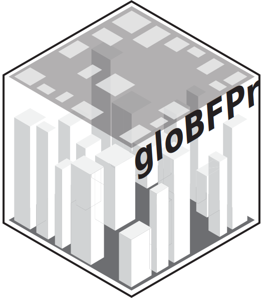
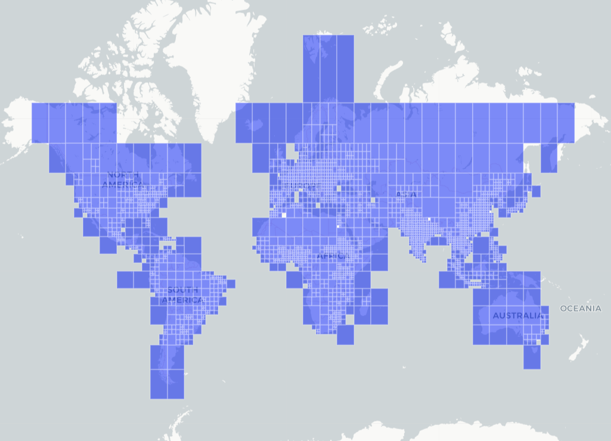

# gloBFPr <a href="https://github.com/billbillbilly/gloBFPr/"></a>

<!-- badges: start -->
[](https://lifecycle.r-lib.org/articles/stages.html#experimental)
[](https://github.com/billbillbilly/gloBFPr/actions/workflows/R-CMD-check.yaml)
<!-- badges: end -->

Access and analyze the Building Footprint Datasets.

## Overview
The `gloBFPr` package allows R users to search, download, and process global 
building footprint tiles with associated height information, derived from the 
3D-GloBFP dataset published by Che et al. (2024, 2025). The data is hosted on 
Zenodo and covers global urban areas in shapefile format. The package will look 
to include more global Building Dataset in the future.



## Features
🔍 Access tiled metadata of 3D-GloBFP dataset and search tiles by bounding box (BBOX) or area of interest

⬇️ Download only the necessary files and retrieve building polygons and height attribute

🌍 Generate rasters of binary presence or graduated height and output spatial data in sf or terra raster forma

## Installation
Install the development version:
```r
# Install devtools if needed
install.packages("devtools")

# Install from GitHub
devtools::install_github("billbillbilly/gloBFPr")
```

The package will be on CRAN soon.

## Usage
1. Load metadata

```r
library(gloBFPr)
metadata <- get_metadata()
```

2. Search and download data by bounding box

```r
bbox <- c(-83.065644,42.333792,-83.045217,42.346988)
buildings_list <- search_3dglobdf(bbox = bbox,
                                  metadata = metadata, 
                                  out_type = "all", 
                                  # mask = TRUE,
                                  cell_size = 1)
```
This will return a list containing:
- poly: an sf object of 3D building footprints
- binary: a binary raster of building presence
- graduated: a raster representing building height in meters

Specify `cell_size = 1` to generate raster layers with 1-meter resolution, 
ensuring detailed spatial representation of building geometries within 
the defined area of interest.

Setting `mask = TRUE` ensures the height raster is masked by the building footprints.

#### Output examples:
<p align="center">
  
&nbsp; &nbsp; &nbsp; &nbsp;
  
</p>

<p align="center">
  
&nbsp; &nbsp; &nbsp; &nbsp;
  
&nbsp; &nbsp; &nbsp; &nbsp;
  
</p>

3. Calculate metrics

| Categories   | Metrics                             | Code      | Concept                                                                 |
|--------------|-------------------------------------|-----------|-------------------------------------------------------------------------|
| **Morphology** | Ground vertex count                 | `g_vcount` | Number of vertices on the building footprint polygon                    |
|              | Ground area                         | `g_area`   | Horizontal footprint area of the building                               |
|              | Perimeter                           | `pmeter`  | Total boundary length of the footprint                                  |
|              | Vertical surface                    | `v_surf`  | Estimated surface area of building walls                                |
|              | Total surface                       | `t_surf`  | Sum of vertical surface and ground area                                 |
|              | Volume                              | `vol`     | Approximate building volume (area × height)                             |
|              | Object-oriented bounding box volume | `obb_vol` | Volume of the smallest rotated bounding box containing the building     |
|              | Perimeter-area ratio                | `pa_ratio`| Indicator of compactness and shape irregularity                         |
|              | Rectangularity                      | `rec`     | Ratio of area to its minimum bounding rectangle                         |
|              | Fractality                          | `fra`     | Complexity of surface based on volume-to-surface ratio                  |
|              | Hemisphericality                    | `hem`     | Deviation from ideal hemisphere volume                                  |
|              | Convexity                           | `cnv`     | Ratio of footprint area to its convex hull area                         |
|              | Cuboidness                          | `cbn`     | Degree to which the object resembles a cuboid                           |
|              | Mean Euclidean distance to centroid | `me_dist` | Average distance from footprint vertices to centroid                    |
|              | Mean pairwise distance              | `mp_dist` | Average distance between all footprint vertex pairs                     |
|              | Volume exchange ratio               | `vol_exch`| Volume-to-surface ratio indicating massiveness                          |
|              | Elongation ratio on X direction     | `elo_x`   | Shortest horizontal extent divided by height                            |
|              | Elongation ratio on Y direction     | `elo_y`   | Longest horizontal extent divided by height                             |
|              | Elongation ratio on Z direction     | `elo_z`   | Height relative to the maximum horizontal extent                        |
| **Demography** | Population density per 10,000 m²     | `pop_den` | Number of people per 10,000 m² around the building                      |
| **Neighbor**   | Number of adjacent buildings        | `n_count` | Count of nearby buildings based on proximity and Voronoi adjacency      |
|                | Mean distance from the building     | `m_ndist` | Average distance to neighboring buildings                               |
|                | Standard deviation of distances     | `sd_ndist`| Variation in distances to neighboring buildings                         |
| **Greenery**   | Distance to the nearest green space | `dng`     | Distance from building centroid to closest vegetation pixel             |
|                | Mean Green View Index (GVI)         | `mean_gvi`| Average proportion of visible green canopy in viewshed                  |
|                | Minimum of Green View Index (GVI)   | `min_gvi` | Lowest GVI across all floor viewpoints                                  |
|                | Maximum of GVI                      | `max_gvi` | Highest GVI across all floor viewpoints                                 |
|                | Standard deviation of GVI           | `sd_gvi`  | Variation in greenery visibility across building height                 |


## Note
The downloading process may take some time, depending on the number and size
of building footprint tiles.

This implementation relies on the current structure of the dataset as hosted on Figshare.
It may break if the dataset owner changes the file organization or metadata format.

Please read the function documentation carefully. The dataset may require proper citation when used.

## Other similar approaches
- [overturemapsr](https://github.com/denironyx/overturemapsr): Fetching OvertureMaps data from S3 and converting it to sf objects for spatial analysis
- [UrbanMapper](https://github.com/VIDA-NYU/UrbanMapper): Spatial join & enrich any urban layer given any external urban dataset of interest
- [3DBM](https://github.com/tudelft3d/3d-building-metrics): Elevating geometric analysis for urban morphology
- [greenR]()

## Issues and bugs
If you discover a bug not associated with connection to the API that is
not already a [reported
issue](https://github.com/billbillbilly/gloBFPr/issues), please [open
a new issue](https://github.com/billbillbilly/gloBFPr/issues/new)
providing a reproducible example.
